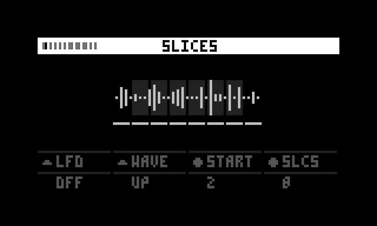
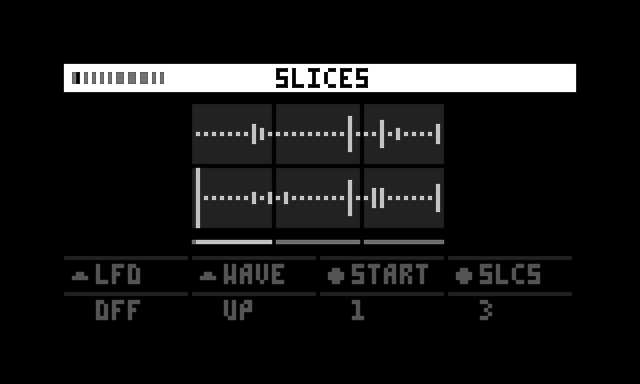
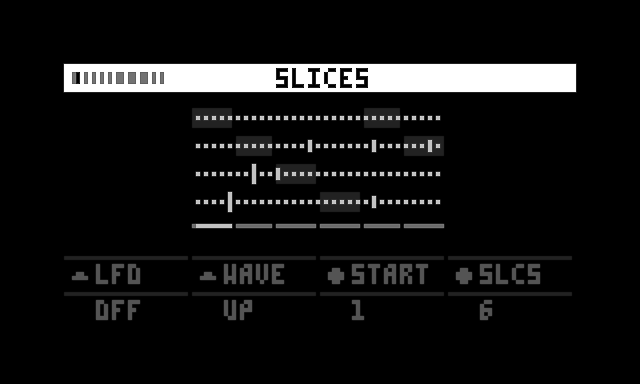
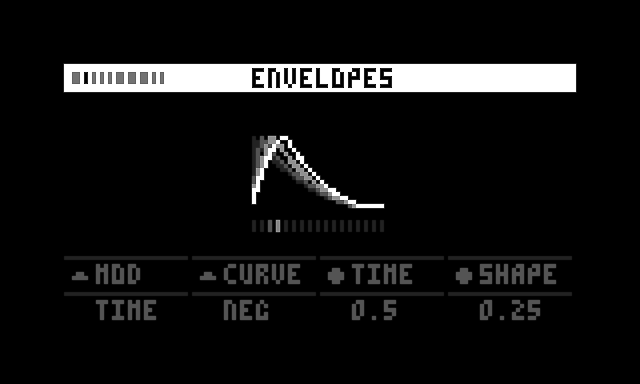
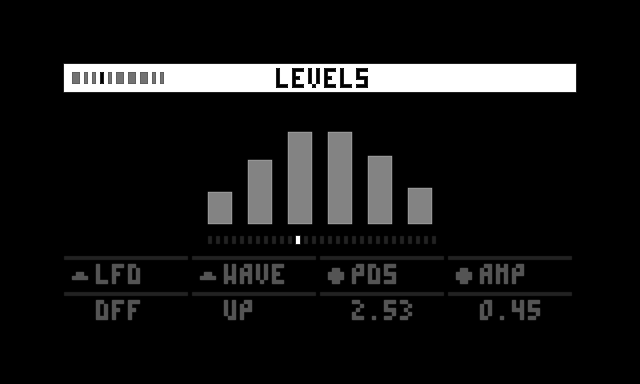
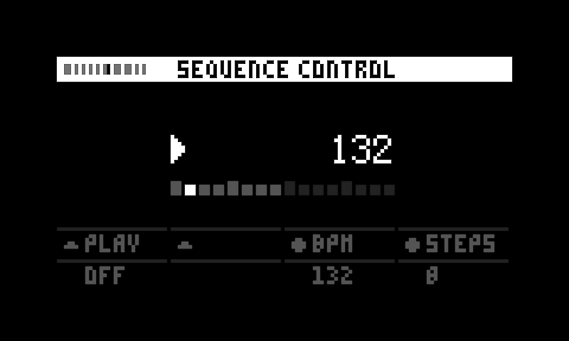
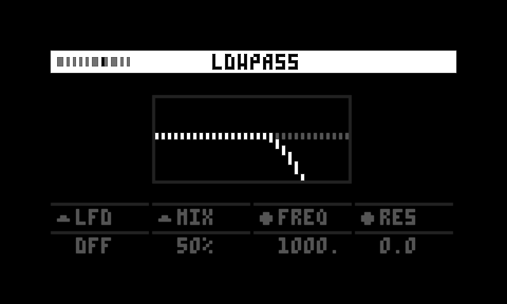

# Eterna

Eterna is a 6-voice sampler and sequencer for creating rhythmic textures and patterns from a single audio file. 

<link to video>

## Requirements

- Norns
- A WAV/AIFF sample (48kHz), which may be mono, stereo or up to 6 channels.

Eterna is designed to have a fast and enjoyable workflow for users with just a Norns, yet future support for other hardware may be considered.

## Documentation

#### Table of contents
- [Overview](#overview) 
- [Pages](#pages)
    - [Sample](#sample)
    - [Slice](#slice)
    - [Envelopes](#envelopes)
    - [Playback rates](#playback-rates)
    - [Levels](#levels)
    - [Panning](#panning)
    - [Sequencer](#sequencer)
    - [Sequence control](#sequence-control)
    - [Lowpass filter](#lowpass-filter)
    - [Highpass filter](#highpass-filter)
    - [Echo](#echo)
    - [Master](#master)

## Overview

#### General controls
The encoder/knob mapping is the same for every page:

- E1: Selects page
- K2 | K3 | E2 | E3: Change corresponding parameter as displayed in footer

## Pages

Eterna consists of 12 separate pages, which may be browsed using E1.

### Sample
Load a sample from disk with K2; the file path becomes the title of the header and shows the duration of the sample. Drive (E2) is available to boost the amplitude of all channels in parallel.

###### Supported formats
- WAV/AIFF at 48kHz - other sample rates will be played back at incorrect pitch
- mono, stereo or multichannel (max. 6 channels)
- Max 5m48s duration; longer samples will be trimmed to this length

#### Controls
- K2: Select sample
- E2: Drive - applies a 0-24dB boost, to each channel equally, soft-clipped using a [tanh function](http://gdsp.hf.ntnu.no/lessons/3/17/).

### Slice

Cut the sample into 1-32 slices with E3. There are 6 voices; each of them is assigned 1 slice for playback. If the number of slices is smaller than 6, one or more slices are used with multiple voices.

When a mono sample is selected, the selected start slice (E2) is assigned to voice 1, while each next slice is assigned to the next voice. See the screenshot below: slice 2 to 7 are assigned to voice 1 to 6.

When a stereo sample is selected, each next slice is taken from the alternating channel:

- slice 1 → channel 1
- slice 2 → channel 2
- slice 3 → channel 1
- slice 4 → channel 2
- slice 5 → channel 1
- slice 6 → channel 2

The graphic doesn't explicitly indicate which slice is assigned to which channel, but when the sequence triggers a voice, the slice flashes according to its envelope, which helps to identify which slice is being played back.

When a multichannel sample is selected (up to 6 channels), each next slice is taken from the next channel, wrapping around back to channel 1 when each channel has provided a slice. 

For an example with a 4-channel file:

- slice 1 → channel 1
- slice 2 → channel 2
- slice 3 → channel 3
- slice 4 → channel 4
- slice 5 → channel 1
- slice 6 → channel 2

#### Controls
- K2: Toggle LFO on/off
- K3: Select LFO waveform
- E2: Start slice (which slice is assigned to voice 1 - when set to 2, slices 2-7 are assigned to voice 1-6)
- E3: Number of slices (1-32)

### Envelopes
Applies an A/D envelope of adjustable duration (E2) and variable curvature (K3) to the amplitude of the slice. A single button, shape (E3), controls how attack and decay relate to each other. The envelope times can be modulated by the sequencer's velocity using the MOD parameter (K2). When Lowpass Gate (LPG) is selected as MOD option, a lowpass filter is enabled for each voice, and the envelope controls not only amplitude, but also cutoff frequency. In this mode, the envelope time is also modulated by the sequencer's velocity.

#### Controls
- K2: Modulation (OFF/TIME/LPG)
- K3: Envelope curve (Negative / Linear / Positive)
- E2: Time - total duration of the envelope
- E3: Shape - skews envelope towards longer decay or longer attack

### Playback rates
Controls the playback rate and direction (FWD/REV/BI) of all voices. The rates are quantized to octaves. All playback rates are changed are linked to each other as if they form a sine wave together. Center (E2) controls the offset of the wave from the center, while spread (E3) controls the height.

From this follows that if spread is zero, the playback rate for every voice is equal. Range (K3) aids in limiting the total range to 3 octaves if desired.

#### Controls
- K2: Select playback direction (forward, reverse or both). When BI is selected, voice 1, 3 and 5 are played forward, while voice 2, 4 and 6 are played in reverse.
- K3: Toggle max. range (3 or 5 octaves) 
- E2: Center (offset from center)
- E3: Spread (how the values are spread over the graph)

### Levels

Controls the levels of all voices via a Gaussian distribution (Bell curve). An LFO is available to automate movement; this affects the position parameter. 

There's also a metering visualization: when playback is active, the current amplitude of each voice is shown realtime inside the bar graphs.

#### Controls
- K2: Toggle LFO on/off
- K3: Select LFO waveform   
- E2: Position of the center of the bell curve; or LFO rate, when the LFO rate is enabled.
- E3: Amp - controls the sigma of the bell curve. When set to 0, this can be used together with Position to solo a voice.

### Panning
Controls the panning of all voices. The position of the voices in the stereo field is spread within the available width (E3), and can be continuously cycled using twist (E2).

#### Controls
- K2: Toggle LFO on/off
- K3: Select LFO waveform
- E2: Twist, which controls the panning of all voices at the same time; or when LFO is on, LFO rate.
- E3: Width - maximum stereo width

### Sequencer
A [Perlin noise](https://en.wikipedia.org/wiki/Perlin_noise)-based sequencer which offers 2 parameters to control the entire 6-track sequence: seed (E2) and density (E3). The velocity of each step is based on the perlin noise value and indicated by the brightness of a step. 

#### Controls
- K2: Toggle transport on/off
- K3: Step divider (1/32, 1/16 or 1/8) - based on the current BPM, where 1/16 divides each beat into 4 steps  (which would make 1 step a 1/16th note in a 4/4 time signature)
- E2: Seed (0-100) controls the x-value of the perlin noise algorithm, generating a reproducible pattern. This value is set to a random initial value when the script is loaded.
- E3: Density (0-1) - controls the amount of active steps, where 0 always gives an empty sequence and 1 always fills all available steps.

### Sequence control
Controls transport, BPM, and sequence length.

- K2: Toggle transport
- K3: - 
- E2: BPM - corresponds to Norns current clock's BPM (which may be the internal clock, external MIDI or Ableton Link)
- E3: Steps (1-16), sets the number of steps in the sequence

### Lowpass filter
The pages for lowpass and highpass are identical except for their filter type.
Each is based on [Supercollider's 12dB/octave SVF filter](https://doc.sccode.org/Classes/SVF.html).

#### Controls
- K2: LFO on/off
- K3: Filter mix (DRY / 50% / WET) - allows to pass the unfiltered signal 
- E2: Frequency (20Hz-20kHz)
- E3: Resonance (0 - 0.98)

### Lowpass filter LFO

A dedicated page to control the LFO for the lowpass filter.

#### Controls
- K2: LFO on/off
- K3: LFO waveform
- E2: LFO rate (synced to clock; 1.00 = 4 beats)
- E3: LFO range (0-16, unipolar) - implemented using `frequency * 2^range`. 

### Echo

A delay effect with a selectable feedback path (K2); *MIST* feeds the delay buffer into a series of allpass filters for a reverb effect, while *DUB* saturates the signal. Echo time (K3) is synced to BPM. Feedback (E2) controls how much of the output is fed back into the delay input. Mix (E3) is really a control for the wet signal only; the dry signal always fully passes.

#### Controls
- K2: Echo style (mist/dub)
- K3: Echo time - always synced to clock: 
    - 1/64
    - 1/32
    - 1/32D
    - 1/16
    - 5/64
    - 1/16D
    - 1/8
    - 5/32
    - 1/8D
- E2: Feedback (0-1)
- E3: Mix (0-1)

### Master
A simple mastering chain to control the final output of the mix. The processing chain includes a Bass Mono stage, which uses a [Linkwitz-Riley filter](https://en.wikipedia.org/wiki/Linkwitz%E2%80%93Riley_filter) to split the signal at a specified frequency and make it mono up to that frequency, as inspired by [Ableton Live's utility device](https://www.ableton.com/en/manual/live-audio-effect-reference/). After the Bass Mono stage, a compressor with three presets is available (soft/medium/hard) - or it may be turned off. 

The history of the last few samples is used to display a [lissajous curve](https://en.wikipedia.org/wiki/Lissajous_curve).

#### Controls
- K2: Bass mono - sums the stereo mix into a mono mix up to a specified frequency:
    - 20Hz (off)
    - 50Hz
    - 100Hz
    - 200Hz
    - 20kHz (full mono)
- K3: Compressor preset - cycles back and forth due to sudden jumps in output levels.
    - off
    - soft
    - medium
    - hard
- E2: Drive (pre-compressor; 0dB to +24dB)
- E3: Output amp (-INF, -60dB to 0dB)

The settings of each compressor preset are as follows:

Soft:
- attack: 10ms
- release: 300ms
- ratio: 1:2
- threshold: -6dB

Medium:
- attack: 10ms
- release: 300ms
- ratio: 1:4
- threshold: -12dB

Hard:
- attack: 10ms
- release: 300ms
- ratio: 1:8
- threshold: -18dB

## Grid Integration

Eterna supports monome grid for hands-on sequence editing and page navigation.

### Grid Layout

- **Rows 1-6:** Sequence steps for tracks 1-6 (16 steps each)
- **Row 7:** Playback position indicator (shows currently active step)
- **Row 8:** Page navigation (buttons 1-14 switch between pages)

### Sequence Editing

Press any button in rows 1-6 to toggle a step on or off. Steps light up with 16 brightness levels (0 = off, 1-15 = velocity). 

### Velocity System

Velocity values are determined by two parameters: **velocity center** and **velocity spread**.

**Center** sets the middle point of your velocity range (0 to 1), while **spread** controls how wide the range is around that center point. The range extends equally in both directions from the center.

For example:
- `center = 0.5, spread = 0` → range is 0.5 to 0.5 (all steps get exactly 0.5)
- `center = 0.5, spread = 1` → range is 0 to 1 (full range, centered at 0.5)
- `center = 0.75, spread = 0.5` → range is 0.5 to 1 (spread of 0.5 extends ±0.25 from center)

Each time a step triggers during playback, it picks a new random velocity within your configured range. This creates evolving dynamics while keeping velocities within your desired bounds.

### Perlin ↔ Grid Switching

Eterna contains a single sequence, which can be controlled using different modes:

**Perlin mode:** Generative sequences created using seed and density encoders

**Grid mode:** Manual step programming via grid 

Different modes edit the same sequence, so switching modes does not alter the sequence until an action is taken - e.g. pressing a grid button or dialing an encoder.

Switch between sources on the sequence control page. When grid is connected and perlin mode is active, pressing any grid button automatically switches to grid mode.
